# Active-Reconnaissance Lab

This lab outlines performing host discovery, port scanning, service version detection, and vulnerability scanning and detection using Nmap. The lab was conducted in a controlled environment to demonstrate various reconnaissance techniques.

## Table of Contents

- [Introduction](#introduction)
- [Host Discovery](#host-discovery)
  - [Nmap Host Discovery](#nmap-host-discovery)
  - [ARP Scan](#arp-scan)
  - [FPing](#fping)
  - [Passive Reconnaissance with Wireshark](#passive-reconnaissance-with-wireshark)
  - [Screenshots](#screenshots-host-discovery)
- [Port Scanning and Host Fingerprinting](#port-scanning-and-host-fingerprinting)
  - [Nmap Port Scanning](#nmap-port-scanning)
  - [Nmap Service Version Detection](#nmap-service-version-detection)
  - [Fingerprinting with Nmap Scripts](#fingerprinting-with-nmap-scripts)
  - [Screenshots](#screenshots-port-scanning)
- [Web Server Enumeration on Port 80](#web-server-enumeration-on-port-80)
  - [Screenshots](#screenshots-web-server-enumeration)
- [Conclusion](#conclusion)

## Introduction

This document contains step-by-step guides for performing active reconnaissance using Nmap and other tools. It covers host discovery, port scanning, service version detection, and web server enumeration. All activity was performed in a virtualized contained environment with three VMs. In this example, arp-scan, nmap, and fping are all utilized to perform network host discovery while the host fingerprinting stage primarily focusing on a Metasploitable2 VM.

## Host Discovery

### ARP-Scan, Nmap Ping Scan, and fping sweep

Perform an arp scan, nmap ping scan, and an pfing scan to discover what hosts are connected to the local network. 

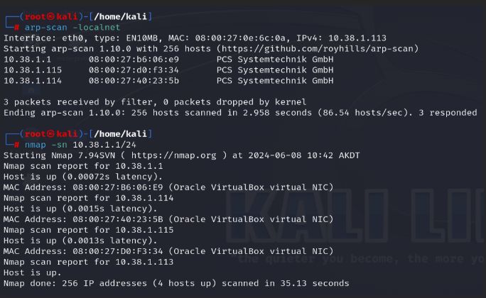

## Port Scanning and Host Fingerprinting

### SYN scan and service version detection. 

### Full port scan and service version detction

### SYN scan, service version detection, and UDP scan: 

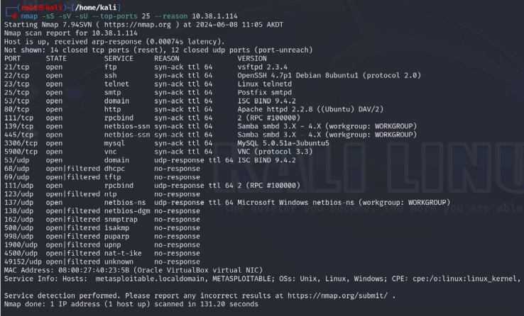

### Port scan for ports 1-10000 and service version detection: 

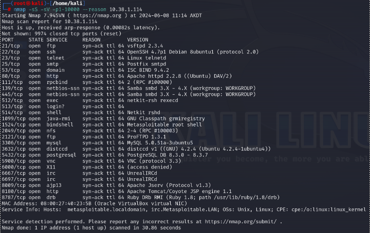

## Fingerprinting with Nmap Scripts

Use Nmap scripts to fingerprint services and gather detailed information. 

### FTP Enumeration

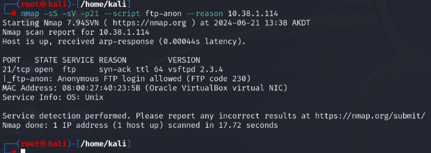

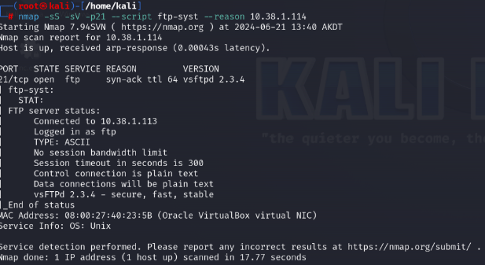

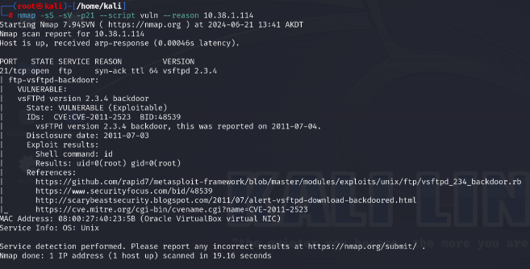

### SSH Enumeration

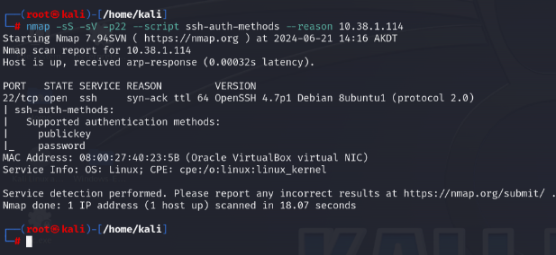

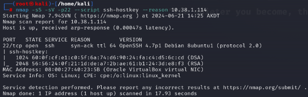

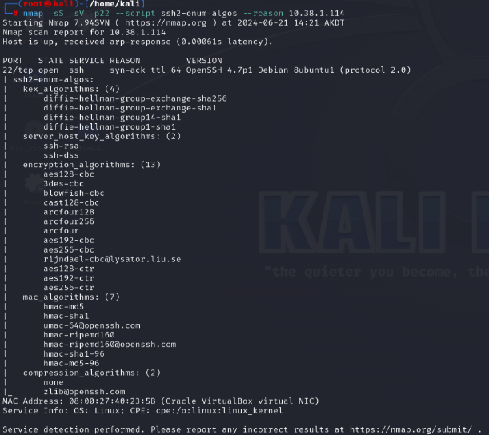

### SMB Enumeration

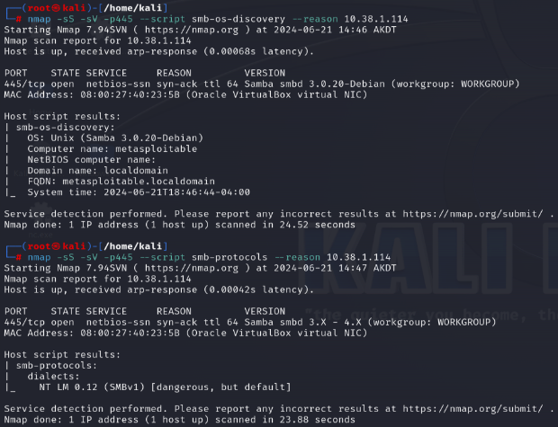

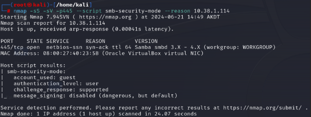

### Web Server Enumeration

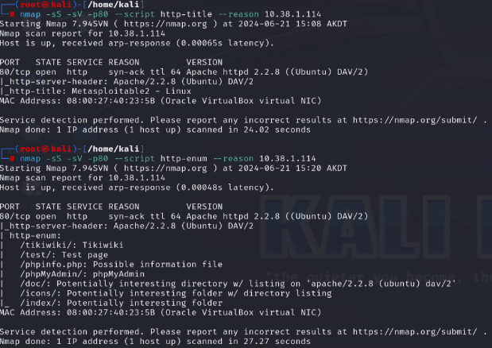

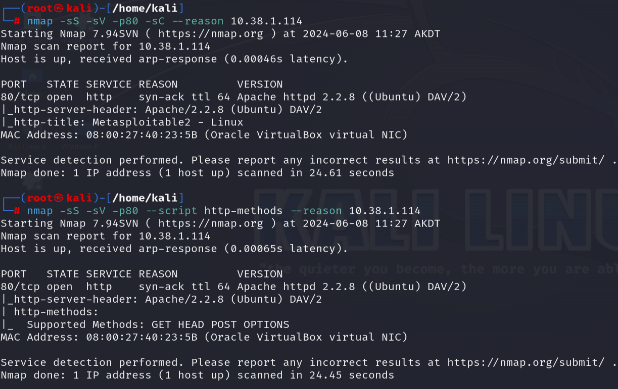

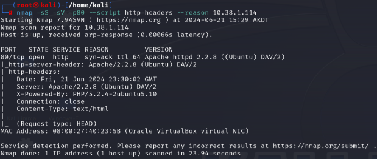

