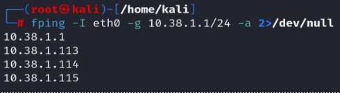
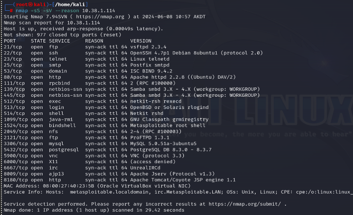

# Active-Reconnaissance Lab

This lab outlines performing host discovery, port scanning, service version detection, and vulnerability scanning and detection using Nmap. The lab was conducted in a controlled environment to demonstrate various reconnaissance techniques.

## Table of Contents

- [Introduction](#introduction)
- [Host Discovery](#host-discovery)
  - [Nmap Host Discovery](#nmap-host-discovery)
  - [ARP Scan](#arp-scan)
  - [FPing](#fping)
  - [Passive Reconnaissance with Wireshark](#passive-reconnaissance-with-wireshark)
  - [Screenshots](#screenshots-host-discovery)
- [Port Scanning and Host Fingerprinting](#port-scanning-and-host-fingerprinting)
  - [Nmap Port Scanning](#nmap-port-scanning)
  - [Nmap Service Version Detection](#nmap-service-version-detection)
  - [Fingerprinting with Nmap Scripts](#fingerprinting-with-nmap-scripts)
  - [Screenshots](#screenshots-port-scanning)
- [Web Server Enumeration on Port 80](#web-server-enumeration-on-port-80)
  - [Screenshots](#screenshots-web-server-enumeration)
- [Conclusion](#conclusion)

## Introduction

This document contains step-by-step guides for performing active reconnaissance using Nmap and other tools. It covers host discovery, port scanning, service version detection, and web server enumeration.

## Host Discovery

### Nmap Host Discovery

Perform a ping scan to discover live hosts on the network: 

### ARP Scan

Perform an ARP scan to discover hosts on the local network:

### Fping

Use Fping to discover live hosts

### Passive Reconnaissance with Wireshark

Use Wireshark to perform passive reconnaissance on the active network by capturing and analyzing network traffic. 

## Port Scanning and Host Fingerprinting

Perform a SYN scan and service version detection. 

Perform a full port scan and service version detction

Perform a SYN scan, service version detection, and UDP scan: 

Perform a port scan for ports 1-10000 and service version detection: 

## Nmap Service Version Detection

After identifying open ports, perform service version detction on individual ports to gather more information. 

## Fingerprinting with Nmap Scripts

Use Nmap scripts to fingerprint services and gather detailed information. 

## Web Server Enumeration on Port 80

Enumerate the web server on port 80 to gather information about the web application and its components. 

